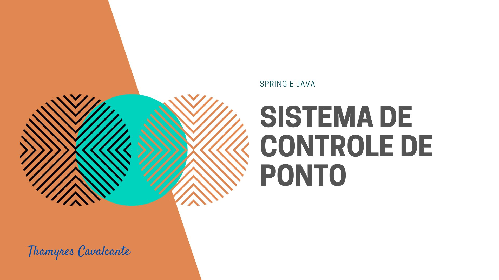
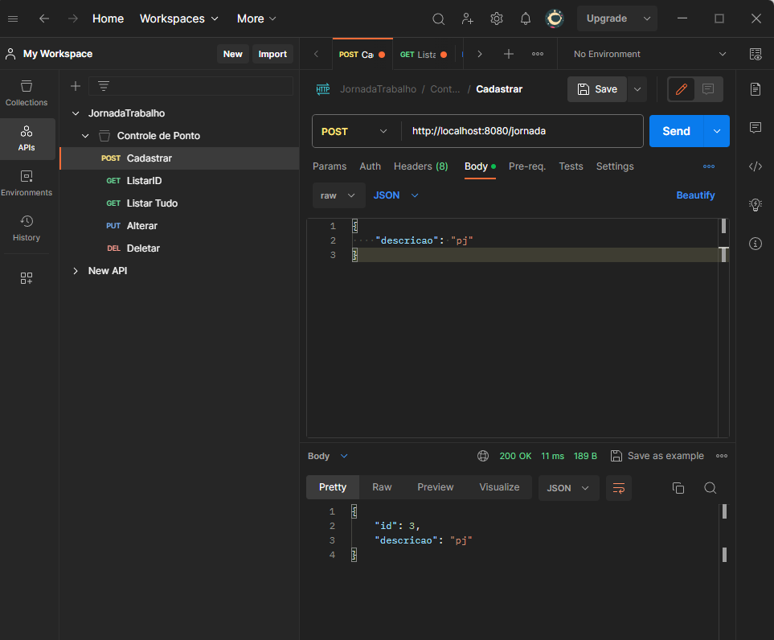
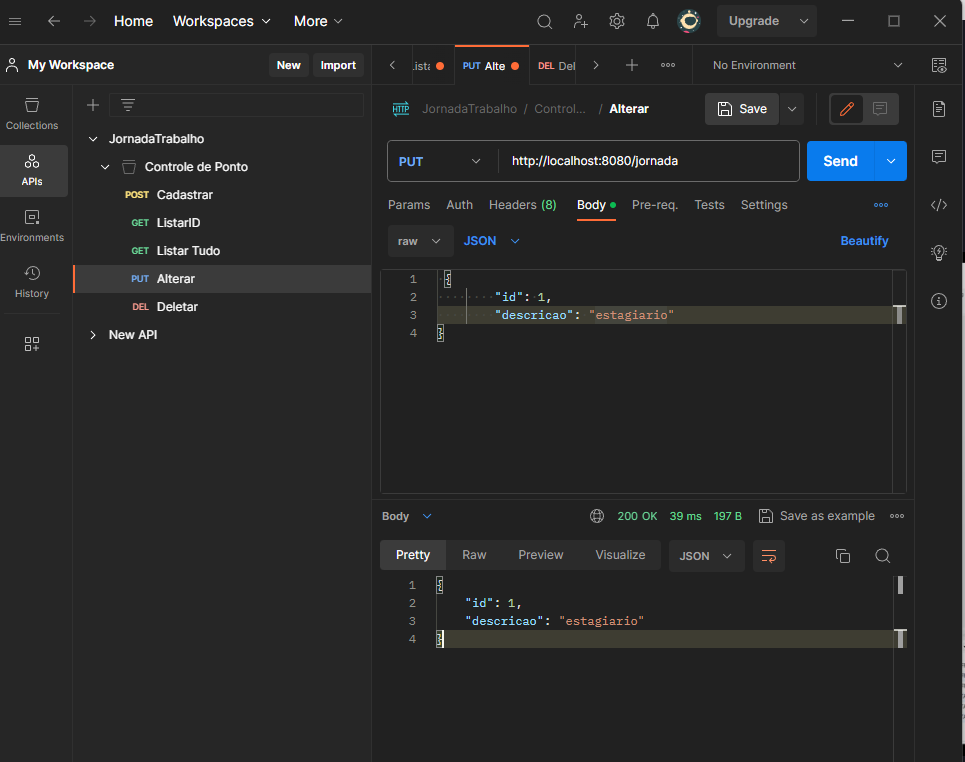
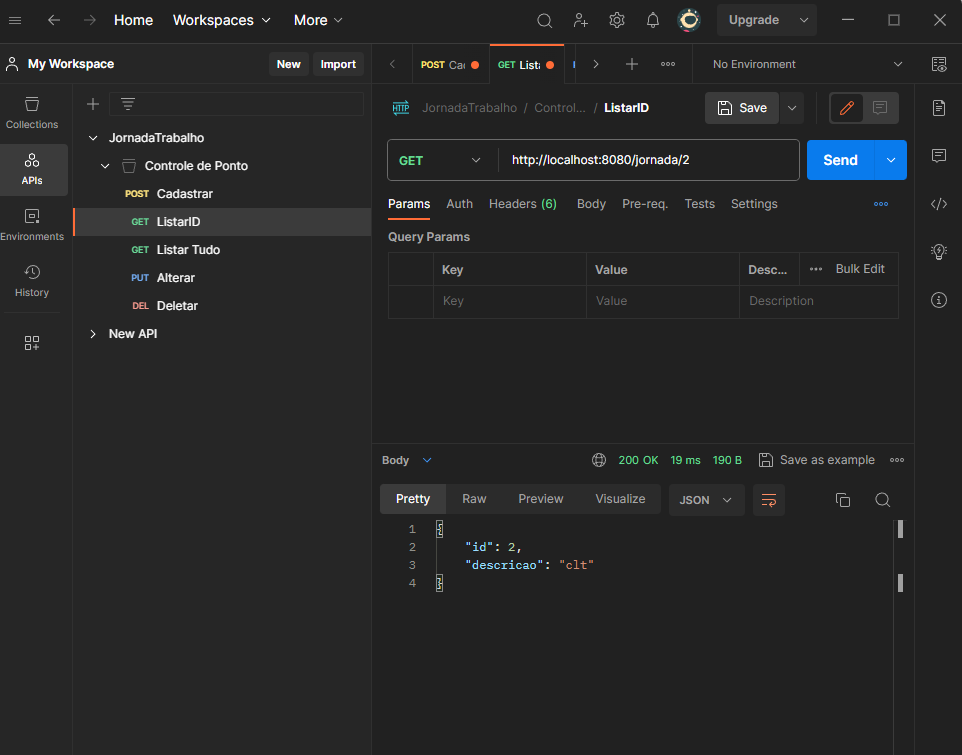
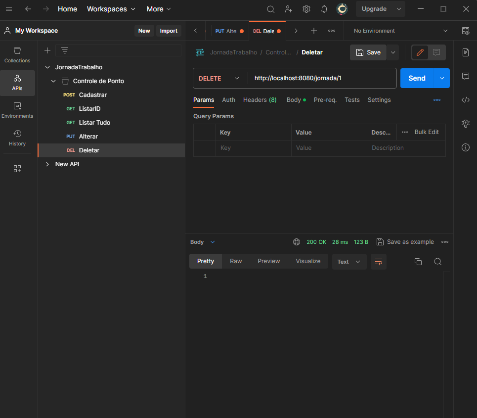
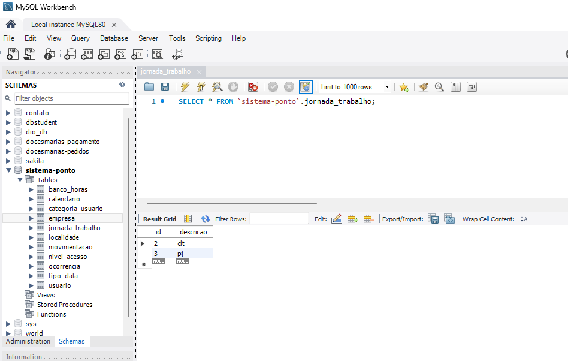

| Projeto | SISTEMA DE CONTROLE DE PONTO  |
| -------------  |--------------------------------|
| Nome        | **Construindo um Sistema de Controle de Ponto e Acesso com Spring Boot**  
| Tecnologias | Java, Intellij, Spring, MySQL, Rest API          
| URL         | https://github.com/Thamyresmya/Sistema-Controle-Ponto

# Índice 
- [Índice](#índice)
- [PROJETO SISTEMA DE CONTROLE DE PONTO](#projeto-sistema-de-controle-de-ponto)
  - [🚀 Tecnologias](#-tecnologias)
  - [💻 Descrição do Projeto](#-descrição-do-projeto)
  - [📁 Acesso ao projeto](#-acesso-ao-projeto)
  - [✔️ Técnicas e tecnologias utilizadas](#️-técnicas-e-tecnologias-utilizadas)
  - [📸 Telas](#-telas)
  - [Me siga nas redes sociais:](#me-siga-nas-redes-sociais)
    - [Feito com 💜 by Thamyres Cavalcante.](#feito-com--by-thamyres-cavalcante)

# PROJETO SISTEMA DE CONTROLE DE PONTO 

## 🚀 Tecnologias

Esse projeto foi desenvolvido com as seguintes tecnologias:

- Java
- Intellij
- Spring
- MySQL
- Rest API
- Postman
- Git e Github

## 💻 Descrição do Projeto

Projeto desenvolvido durante a live da DIO, ultilizando java, spring, MySQL e a IDE Intellij. O projeto consiste em criar um sistema de controle de ponto, desenvolvendo um CRUD. 

## 📁 Acesso ao projeto

É possível acessar o código através do [Link](https://github.com/Thamyresmya/Sistema-Controle-Ponto)

Neste repositório você tem acesso a todo o material desenvolvido.

## ✔️ Técnicas e tecnologias utilizadas

- `JAVA`:  A linguagem de programação Java é objetivada principalmente na orientação a objeto, independência de plataforma, recursos de rede, carga dinâmica de código e segurança, além disso, é uma linguagem copilada.

 

## 📸 Telas
**Cadastro de Jornada de Trabalho**  
</img>

**Alteração de Jornada de Trabalho** 
</img>

**Lista por ID Jornada de Trabalho** 
</img>

**Lista todas Jornada de Trabalho** 
</img>

**Deletar Jornada de Trabalho** 
</img>

**Banco de Dados** 
</img>

**CRUD**
</img>

<video width="100%" height="300" controls>
  <source src="./geral/Sistema_Controle_Ponto.mp4" type="video/mp4">
</video>

 

## Me siga nas redes sociais:
- [Linkedin](https://www.linkedin.com/in/thamyrescavalcante/)
- [Instagran](https://www.instagram.com/thamyres__cavalcante/)

 

---

### Feito com 💜 by Thamyres Cavalcante.